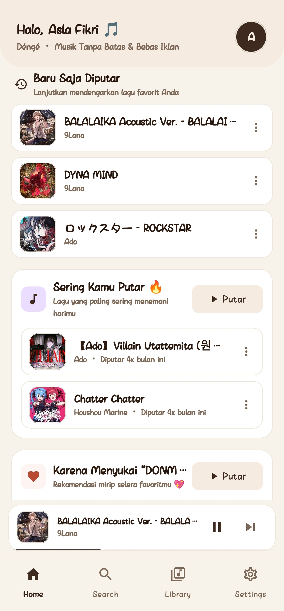
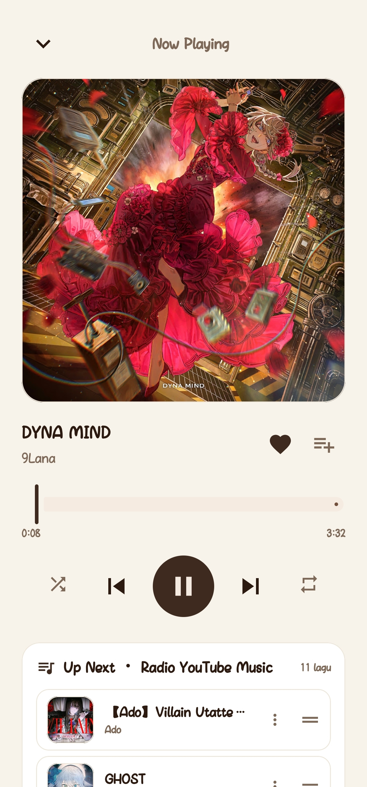

# Déngé ☕

  <b>A lightweight, privacy-first, and completely ad-free music streaming client for Android.</b>

  
  
  
  
  

  
  &nbsp;
  

---

## 📸 Screenshots Showcase

  
  &nbsp;
  
  &nbsp;
  

  <i>Beranda Pribadi & Rekomendasi &nbsp;•&nbsp; Layar Pemutar & Antrean Radio &nbsp;•&nbsp; Preview Cover HD & Tombol Share</i>

---

## 🌟 Fitur Unggulan

- **🚫 100% Bebas Iklan (Ad-Free)**  
  Streaming audio berkecepatan tinggi tanpa interupsi iklan suara maupun jeda video sponsor.

- **🎧 Pemutaran Latar Belakang (True Background Playback)**  
  Musik tetap berjalan stabil saat layar mati atau saat membuka aplikasi lain. Terintegrasi penuh dengan notifikasi sistem, lockscreen controls, dan status bar dinamis (*Dynamic Island*).

- **☕ Tema Hangat "Brew & Bean"**  
  Tampilan estetik berpalet warna kopi (Espresso, Warm Mocha, Hazelnut, Creamy Latte) yang nyaman di mata dengan desain layar penuh *Edge-to-Edge*.

- **🔒 Privasi Utuh & Tanpa Akun (Zero-Backend)**  
  Aplikasi berjalan murni di perangkat kamu. Tidak perlu login akun Google, tanpa database server perantara, dan bebas dari pelacakan privasi. Kamu bisa mengganti nama panggilan profilmu kapan saja.

- **📊 Pustaka Pintar & Reset Bulanan**  
  - **Yang Sering Kamu Putar**: Menampilkan 2 lagu teratas yang paling sering didengarkan lengkap dengan penghitung putaran real-time yang otomatis di-reset setiap tanggal 1 setiap bulannya.
  - **Liked Songs (♥)** & Playlist kustom tersimpan langsung di memori HP kamu.
  - Riwayat pemutaran dan riwayat pencarian cepat.

- **🔗 HD Artwork Preview & Quick Share**  
  Ketuk gambar cover lagu di layar Now Playing untuk melihat artwork dalam resolusi tinggi, dan gunakan tombol **Share** untuk langsung menyalin link lagu resmi ke clipboard dalam satu ketukan.

- **🎚️ Audio Equalizer & Kurasi Genre**  
  Equalizer audio bawaan dengan beragam preset (Bass Boost, Vocal, Rock, Flat) serta kurasi genre lagu di Beranda yang dapat kamu atur sesuai selera mendengarmu.

---

## 📱 Panduan Pemasangan Cepat

1. **Unduh File APK:**  
   👉 **[Download `Denge.apk` Versi Terbaru](https://github.com/masrigaa/Denge-MusicApp/releases/latest/download/Denge.apk)**
2. **Pasang di HP:**  
   Buka file `.apk` yang selesai diunduh. Jika muncul notifikasi keamanan instalasi dari luar browser, pilih **"Izinkan penginstalan dari sumber ini"** (*Allow from this source*).
3. **Mulai Mendengarkan:**  
   Buka **Déngé**, cari lagu favoritmu, dan nikmati musik tanpa batas!

> 💡 **Tips Agar Musik Tidak Terputus di Background:**  
> Pada beberapa tipe HP Android, sistem operasi cenderung membatasi jaringan saat layar mati. Agar pemutaran musik tetap lancar, buka **Info Aplikasi Déngé > Penghemat Baterai**, lalu ubah ke **"Tidak ada pembatasan (No restrictions / Unrestricted)"**.

---

## ⚙️ Persyaratan Sistem

| Spesifikasi | Kebutuhan Minimum | Rekomendasi |
|---|---|---|
| **Sistem Operasi** | Android 12 (API 31) | Android 13, 14, 15+ |
| **Ukuran Aplikasi** | ~35 MB | ~35 MB |
| **RAM** | 2 GB | 3 GB atau lebih |
| **Koneksi** | Wi-Fi / Data Seluler (3G/4G/5G) | Koneksi stabil |
| **Izin Aplikasi** | Akses Internet, Notifikasi Media | Tanpa izin kontak/kamera |

---

## ⚖️ Disclaimer

- **Tujuan Edukasi**: Déngé adalah proyek pemutar media open-source yang dikembangkan untuk tujuan riset dan pembelajaran.
- **Merek Dagang**: YouTube dan YouTube Music adalah merek dagang terdaftar milik Google LLC. Proyek ini tidak berafiliasi dengan, disponsori, atau didukung oleh Google LLC.
- **Fair Use**: Aplikasi ini tidak meng-host atau mendistribusikan file audio berhak cipta; seluruh aliran audio diakses langsung dari endpoint publik oleh perangkat pengguna.

---

  Dibuat dengan ☕ oleh <b>Asla</b>

