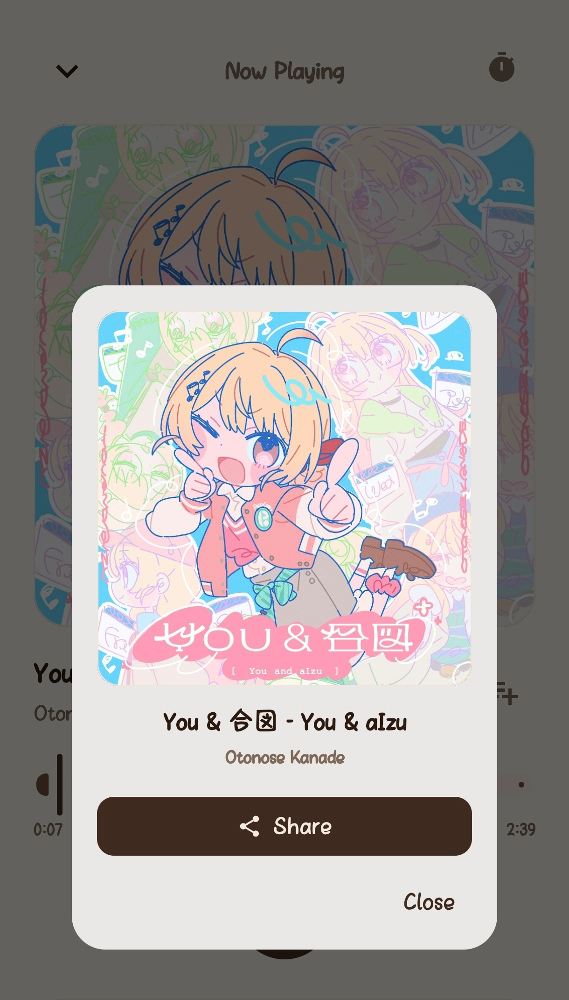
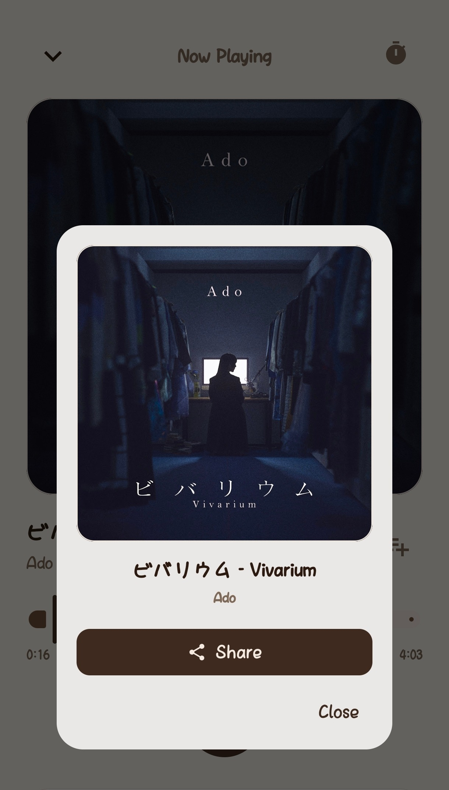
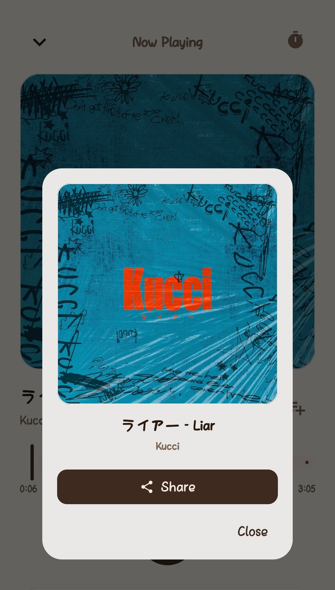
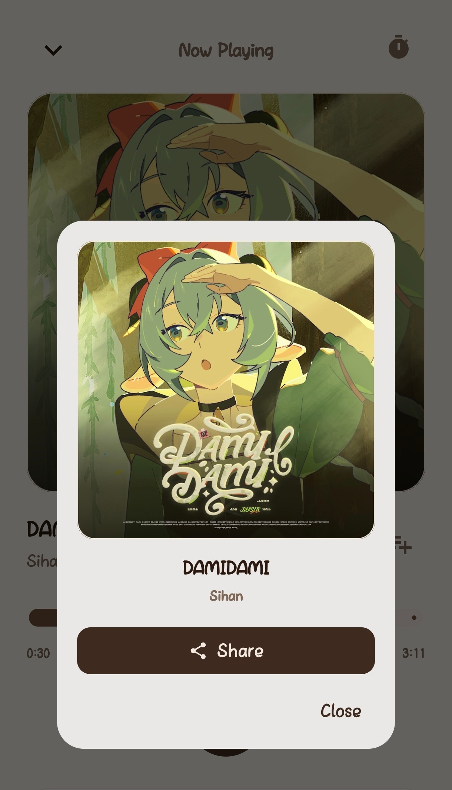

# Déngé ☕

  <b>A lightweight, privacy-first, and completely ad-free music streaming client for Android.</b>
   
  <code>android</code> &nbsp;•&nbsp; <code>kotlin</code> &nbsp;•&nbsp; <code>jetpack-compose</code> &nbsp;•&nbsp; <code>music-player</code> &nbsp;•&nbsp; <code>innertube</code> &nbsp;•&nbsp; <code>ad-free</code>

  
  
  
  
  

  
  &nbsp;
  

---

## 📸 Screenshots Showcase

  
  &nbsp;&nbsp;
  

  <i>Personalized Home & Recommendations &nbsp;•&nbsp; Now Playing Screen & Radio Queue</i>

 

  
  &nbsp;
  
  &nbsp;
  
  &nbsp;
  

  <i>High-Resolution Artwork Preview Modal & Quick Share Link Button</i>

---

## 🌟 Key Features

- **🚫 100% Ad-Free Streaming**  
  High-speed audio streaming with zero audio ads, sponsored interruptions, or video pauses.

- **🎧 True Background Playback**  
  Playback stays smooth and uninterrupted with the screen locked or while multitasking across other apps. Fully integrated with system media notifications, lock screen controls, and dynamic status bars.

- **☕ Warm "Brew & Bean" Theme**  
  An aesthetic coffee palette (Espresso, Warm Mocha, Hazelnut, and Creamy Latte) with an immersive edge-to-edge layout that is easy on the eyes.

- **🔒 Zero-Backend & Complete Privacy**  
  Runs entirely on your device. No Google account login required, no intermediary servers or tracking databases. Customize your listener profile name locally anytime.

- **📊 Smart Library & Monthly Reset Counter**  
  - **Your Top Plays**: Displays your top 2 most frequently played tracks with a real-time play counter that automatically resets on the 1st of each month.
  - **Liked Songs (♥)** & Custom Playlists stored safely on your local device.
  - Search history with instant recall and playback history.

- **🔗 HD Artwork Preview & Quick Share**  
  Tap the album art in the Now Playing screen to inspect HD cover artwork, and tap **Share** to copy the track link directly to your clipboard in a single tap.

- **🎚️ Audio Equalizer & Custom Genre Curation**  
  Built-in audio equalizer with versatile presets (Bass Boost, Vocal, Rock, Flat) alongside customizable Home genre tabs tailored to your taste.

---

## 📱 Quick Installation Guide

1. **Download APK:**  
   👉 **[Download Latest `Denge.apk`](https://github.com/masrigaa/Denge-MusicApp/releases/latest/download/Denge.apk)**
2. **Install on Device:**  
   Open the downloaded `.apk` file. If prompted with an unknown sources prompt, select **"Allow from this source"**.
3. **Start Listening:**  
   Launch **Déngé**, pick your favorite genres or tracks, and enjoy unlimited music!

> 💡 **Background Playback Optimization Tip:**  
> On select Android devices, aggressive battery management may restrict background network activity. For seamless background playback, navigate to **Déngé App Info > Battery Usage**, and select **"Unrestricted"**.

---

## ⚙️ System Requirements

| Specification | Minimum | Recommended |
|:---|:---:|:---:|
| **Operating System** | Android 12 (API 31) | Android 13, 14, 15+ |
| **App Size** | ~35 MB | ~35 MB |
| **RAM** | 2 GB | 3 GB or more |
| **Network** | Wi-Fi / Cellular (3G/4G/5G) | Stable connection |
| **Permissions** | Internet, Media Notification | No contacts/camera needed |

---

## 📚 Project Documentation

Explore technical architecture, design guidelines, and contribution rules in the [`docs/`](docs/) directory:

- 🏛️ [Architecture.md](docs/Architecture.md) — System architecture, data flow, and Koin dependency modules.
- 🎨 [Design.md](docs/Design.md) — UI/UX design guide and Warm Coffee "Brew & Bean" color tokens.
- 📋 [PRD.md](docs/PRD.md) — Product Requirements Document and feature specifications.
- 📏 [Rules.md](docs/Rules.md) — Code style guidelines, conventions, and contribution guardrails.
- 🗄️ [Schema.md](docs/Schema.md) — Room database schema, local entities, and data relations.

---

## ⚖️ Disclaimer

- **Educational Purpose**: Déngé is an open-source media player developed strictly for educational, research, and personal use.
- **Trademarks**: YouTube and YouTube Music are registered trademarks of Google LLC. This project is not affiliated with, sponsored by, or endorsed by Google LLC.
- **Fair Use**: This application does not host or distribute copyrighted audio files; all streams are resolved directly from public endpoints by the client device.

---

  Crafted with ☕ by <b>Asla</b>

