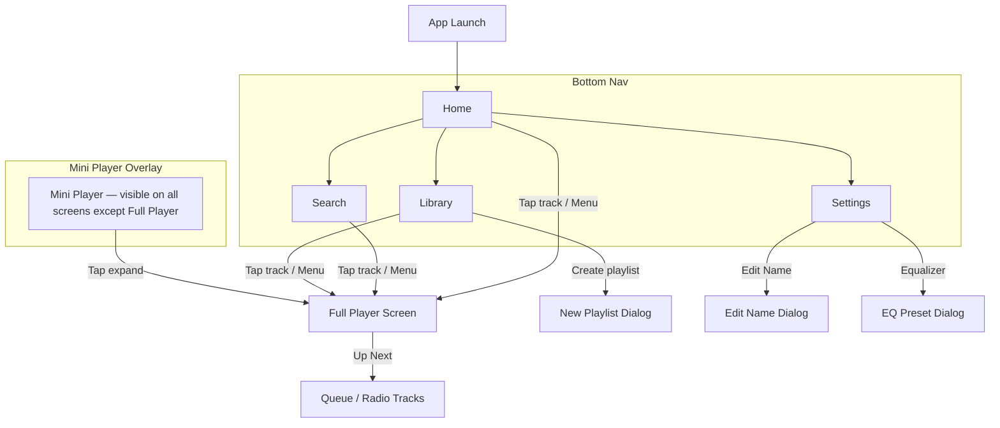

# Design.md — Déngé UI/UX Design System

## Purpose

This document defines the **visual design system** and **screen-level UI/UX flows** for Déngé. It adapts the "Brew & Bean Coffee DNA" blueprint into a music-centric warm dark theme. Functional logic flows live in `PRD.md`; tech stack in `Architecture.md`.

---

## 1. UI/UX Flow (Visual — Screen Navigation)

### 1.1 Main Navigation Map

### 1.2 Screen Inventory

| Screen             | Route            | Bottom Nav Item | Description                              |
|--------------------|------------------|-----------------|------------------------------------------|
| Home               | `/home`          | Home 🏠         | Personalized greeting, recently played, 5 genre shelves |
| Search             | `/search`        | Search 🔍       | Instant debounced search with playback & queue options |
| Library            | `/library`       | Library 📚      | Custom playlists, Liked Songs, Listening history |
| Settings           | `/settings`      | Settings ⚙️     | User profile, audio equalizer, theme & app info |
| Full Player        | `/player`        | — (overlay)     | HD album art, scrub slider, controls, Up Next radio |

---

## 2. Design System: Brew & Bean Theme ☕

A warm, premium coffee-house aesthetic crafted with curated mocha, latte, and cream tones:

### 2.1 Color Palette

| Token               | Hex Code        | Role / Usage                                |
|----------------------|-----------------|---------------------------------------------|
| `primary`            | `#8D6E63`       | Warm Medium Roast — Buttons, active sliders |
| `on-primary`         | `#FFFFFF`       | Text/icons on primary surfaces               |
| `primary-container`  | `#D7CCC8`       | Light roast badge & accent containers        |
| `surface`            | `#2B2321`       | Deep Espresso dark surface                  |
| `surface-variant`    | `#3E322E`       | Warm Mocha headers & elevated card containers|
| `background`         | `#1E1816`       | Dark Coffee Bean ambient background          |
| `on-surface`         | `#F5EBE6`       | Creamy Latte white primary text             |
| `on-surface-variant` | `#BCAAA4`       | Hazelnut secondary / subtitle text          |
| `outline-variant`    | `#5D4037`       | Subtle card & divider borders               |
| `accent-gold`        | `#D4AF37`       | Highlights & active badges                  |

### 2.2 Typography

Following DNA voice — no specific font family mandated by DNA; we choose **Inter** (Google Fonts, free):

| Role           | Size   | Weight | Line Height | Tracking   | Usage                            |
|----------------|--------|--------|-------------|------------|----------------------------------|
| `display`      | 20sp   | 900    | 1.25        | tight      | Now Playing track title           |
| `heading1`     | 17sp   | 900    | 1.35        | —          | Screen hero headlines             |
| `heading2`     | 17sp   | 700    | 1.35        | 0.025em    | Dark header titles                |
| `heading3`     | 14sp   | 900    | 1.4         | —          | Card/section titles               |
| `body`         | 13sp   | 500–600| 1.6         | —          | Descriptions, artist names        |
| `bodySmall`    | 11sp   | 600    | 1.5         | —          | Meta info, durations              |
| `caption`      | 10sp   | 600    | 1.4         | —          | Counts, labels                    |
| `micro`        | 10sp   | 900    | 1.3         | 0.05em     | Uppercase status labels           |
| `numericHero`  | 20sp   | 900    | 1.0         | —          | Stats (play count, duration)      |

### 2.3 Spacing & Radius

From DNA spacing rhythm:

| Token            | Value  | Usage                                   |
|------------------|--------|-----------------------------------------|
| `screen-padding` | 20dp   | Horizontal page margins                  |
| `card-gap`       | 16dp   | Vertical gap between cards               |
| `section-gap`    | 20dp   | Gap between sections                     |
| `radius-hero`    | 24dp   | Album art cards, full player card        |
| `radius-card`    | 20dp   | Standard cards (playlist, track list)    |
| `radius-tile`    | 16dp   | Input fields, small tiles                |
| `radius-key`     | 12dp   | Icon buttons, small elements             |
| `radius-chip`    | 999dp  | Full pill — chips, pills, toggle knobs   |
| `radius-sheet`   | 40dp   | Bottom sheets, dark header bottom curve  |

---

## 3. Component Library

### 3.1 Dark Curved Header (DNA Mandatory)

The signature top element on every screen:

| Property       | Value                                                      |
|----------------|------------------------------------------------------------|
| Background     | `surface-dark`                                              |
| Bottom radius  | 40dp curve                                                  |
| Side padding   | 24dp                                                        |
| Height         | Auto (content + 16dp top + 24dp bottom)                     |
| Title          | 17sp bold (`heading2`), color `on-dark`                     |
| Buttons        | 40dp touch targets, 24dp icons, color `on-dark`             |
| Overlap        | Overlaps body content by 32dp                                |

### 3.2 Dipped Cutout Bottom Nav (DNA Mandatory)

Music-adapted bottom navigation:

| Property         | Value                                                     |
|------------------|-----------------------------------------------------------|
| Background       | `surface-dark`                                             |
| Height           | 90dp                                                       |
| Width            | Full width (max 390dp on tablet)                            |
| Cutout           | Right-side dip for FAB placement                            |
| Icon size        | 24dp                                                        |
| Active state     | `on-dark` icon + 8dp `accent` dot at top-right              |
| Items            | Home · Search · Library · Settings                          |
| Render           | SVG path for dip shape                                      |

### 3.3 FAB Play Button (DNA Mandatory)

Adapted from "fab-elevated" — now the primary play/pause action:

| Property       | Value                                                      |
|----------------|------------------------------------------------------------|
| Size           | 56dp circle                                                 |
| Background     | `primary`                                                   |
| Icon           | Play ▶ / Pause ⏸, 24dp, color `on-primary`                 |
| Position       | Seated in nav dip, top offset -12dp                          |
| Rim            | 3dp translucent ring                                         |
| Interaction    | Scale on press (1.0 → 0.92 → 1.0, 150ms)                   |

### 3.4 Track Card

| Property       | Value                                                      |
|----------------|------------------------------------------------------------|
| Shape          | 20dp radius, hairline `border-subtle` edge                   |
| Padding        | 16dp                                                        |
| Layout         | Row: 48dp album art (12dp radius) · Column(title + artist) · duration |
| Title          | `heading3` 14sp bold                                         |
| Artist         | `body` 13sp, `foreground-muted`                              |
| Duration       | `bodySmall` 11sp, `foreground-muted`                         |
| Elevation      | `elevation-level-1`                                          |
| Active state   | Left border 3dp `primary`, title color → `primary`           |

### 3.5 Mini Player

| Property       | Value                                                      |
|----------------|------------------------------------------------------------|
| Position       | Fixed above bottom nav, full width                           |
| Height         | 64dp                                                        |
| Shape          | 20dp top radius, 0 bottom                                   |
| Background     | `surface-card`                                               |
| Elevation      | `elevation-level-2`                                          |
| Layout         | Row: 48dp album art · Column(title + artist) · play/pause · next |
| Gesture        | Swipe up → expand to full player                             |

### 3.6 Playlist Card

| Property       | Value                                                      |
|----------------|------------------------------------------------------------|
| Shape          | 20dp radius                                                  |
| Layout         | Vertical: 120dp cover art (24dp radius) · title · track count |
| Grid           | 2-column grid, 12dp gutter (DNA grid spec)                   |

### 3.7 Pill Tab Row (DNA Optional)

For search result tabs (Songs · Artists · Albums · Playlists):

| Property       | Value                                                      |
|----------------|------------------------------------------------------------|
| Shape          | Full pill (`radius-chip`)                                    |
| Active         | `primary` background, `on-primary` text                      |
| Inactive       | Transparent, `foreground-muted` text, hairline border        |
| Gap            | 8dp between pills                                            |

### 3.8 Input / Search Field

| Property       | Value                                                      |
|----------------|------------------------------------------------------------|
| Shape          | 16dp radius                                                  |
| Border         | 2dp outline, `border-subtle`                                 |
| Focus          | Border shifts to `primary`                                   |
| Height         | 48dp                                                         |
| Text           | 13sp semibold                                                |
| Leading icon   | Search glyph, 16dp offset                                    |

### 3.9 Bottom Sheet

Used for: Lyrics, Equalizer, New Playlist

| Property       | Value                                                      |
|----------------|------------------------------------------------------------|
| Top radius     | 40dp (`radius-sheet`)                                        |
| Handle         | 40dp wide, 4dp tall, `border-subtle` color, centered         |
| Background     | `surface-card`                                               |
| Max height     | 85% screen height                                            |
| Scrim          | 40% black overlay                                            |

---

## 4. Layout & Spacing

### 4.1 Grid System

| Property       | Value                                     |
|----------------|-------------------------------------------|
| Columns        | 1 (default), 2 (playlist grid, stat tiles) |
| Gutters        | 12dp                                       |
| Screen padding | 20dp sides                                 |
| Max width      | 390dp (phone), sidebar nav on tablet        |

### 4.2 Breakpoints

| Breakpoint       | Width       | Behavior                                     |
|------------------|-------------|----------------------------------------------|
| Compact (phone)  | < 600dp     | Bottom nav, single column, full-width player  |
| Medium (tablet)  | 600–840dp   | Bottom nav, 2-column library grid              |
| Expanded         | > 840dp     | Left sidebar nav (DNA contract), side player   |

### 4.3 Bottom Clearance

All scrollable content must clear `nav height (90dp) + mini player (64dp) + gap (16dp)` = **170dp** bottom padding.

---

## 5. States & Feedback

| State    | Visual Treatment                                                            |
|----------|-----------------------------------------------------------------------------|
| Loading  | Shimmer placeholder (pulsing `surface-muted` → `surface-card`, 1.5s cycle) |
| Error    | `danger` tinted card with icon + message + retry button                      |
| Empty    | Centered illustration + instructional text (DNA: `empty_state_approach: instructional`) |
| Success  | Brief snackbar with `success` color, auto-dismiss 3s                         |
| Active   | `primary` color highlight + scale micro-animation                            |
| Disabled | 40% opacity, no interaction                                                  |

### Micro-Animations (DNA: `motion_intensity: 2` = low)

| Animation        | Spec                                          |
|------------------|-----------------------------------------------|
| FAB press        | Scale 1.0 → 0.92 → 1.0, 150ms ease-out       |
| Nav item switch  | Crossfade 200ms                                |
| Card press       | Scale 1.0 → 0.98 → 1.0, 100ms                 |
| Sheet open       | Slide up 300ms, spring damping                  |
| Mini player swipe| Vertical drag with velocity-based fling         |
| Progress bar     | Smooth 16ms frame updates                       |

---

## 6. Technical Design Decisions (NFR Implementation)

### 6.1 Dark Mode

- **Default mode**: Dark (music app convention)
- Light mode available in settings
- Uses DNA token bindings with light/dark value pairs (Section 2.1)
- Implemented via Compose `MaterialTheme` with `darkColorScheme` / `lightColorScheme`

### 6.2 Accessibility (WCAG 2.1 AA)

> Target set in `PRD.md` NFR section.

| Guideline          | Implementation                                                    |
|--------------------|-------------------------------------------------------------------|
| Color contrast     | All text meets 4.5:1 ratio (verified against palette above)        |
| Touch targets      | Minimum 48dp × 48dp for all interactive elements                   |
| Content descriptions| `contentDescription` on all icons and images                       |
| Screen reader      | TalkBack support via Compose semantics API                         |
| Focus order        | Logical tab order following visual layout                           |
| Motion             | Respect `Settings.Global.ANIMATOR_DURATION_SCALE`                   |

### 6.3 Responsive Layout

- Compact/Medium/Expanded breakpoints (Section 4.2)
- DNA nav contract: bottom bar (compact) → left sidebar (expanded)
- Adaptive layouts via `WindowSizeClass` API

---

## 7. Assets & Naming Convention

### 7.1 Icons

- Source: Material Symbols (Outlined, weight 400, grade 0, 24dp optical size)
- Format: Vector drawables (XML) in `res/drawable/`
- Naming: `ic_{category}_{name}_{size}dp.xml`
  - Examples: `ic_player_play_24dp.xml`, `ic_nav_home_24dp.xml`, `ic_action_search_24dp.xml`

### 7.2 Images

- Album art: Loaded remotely via Coil, no local assets
- Placeholder: `img_placeholder_album.xml` (vector)
- App icon: `ic_launcher.xml` (adaptive icon)

### 7.3 Naming Conventions

| Asset Type      | Pattern                          | Example                      |
|-----------------|----------------------------------|------------------------------|
| Drawable icon   | `ic_{scope}_{name}_{size}dp`     | `ic_player_shuffle_24dp`     |
| Drawable image  | `img_{name}`                     | `img_placeholder_album`      |
| Color resource  | `color_{token_name}`             | `color_primary`              |
| Dimen resource  | `dimen_{scope}_{property}`       | `dimen_card_radius`          |
| String resource | `str_{screen}_{element}`         | `str_home_greeting`          |
| Composable      | `PascalCase` function name       | `MiniPlayer`, `TrackCard`    |

---

*Last updated: 2026-09-24*
