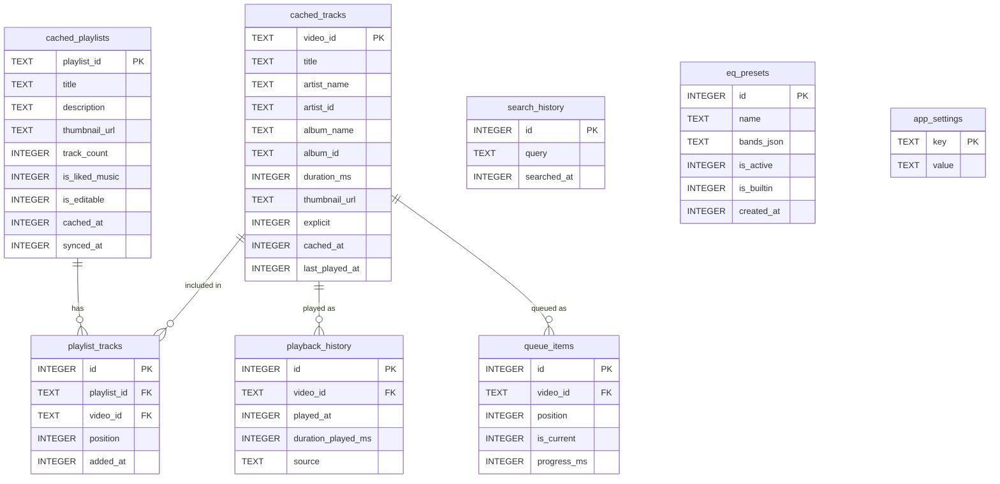

# Schema.md — Déngé Database Schema
 
## Tujuan
 
This document defines the **local database schema** (Room / SQLite) for Déngé. The app has no backend — all persistent data lives on-device. This schema covers cached music metadata, user preferences, playback history, and local queue state.

> **Note:** Playlist and library data originates from YouTube Music (via Innertube API). The local database caches this data for offline access, faster loading, and local-only features (queue, history, EQ presets).

---

## 1. Table Overview

| Table                | Purpose                                                         |
|----------------------|-----------------------------------------------------------------|
| `cached_tracks`      | Cache of track metadata fetched from Innertube                   |
| `cached_playlists`   | Cache of user's YouTube Music playlists                          |
| `playlist_tracks`    | Join table: tracks within a playlist (ordered)                   |
| `playback_history`   | Log of played tracks with timestamps                             |
| `queue_items`        | Current playback queue state                                     |
| `search_history`     | Recent search queries                                            |
| `eq_presets`         | Custom equalizer presets                                         |
| `app_settings`       | Key-value store for app preferences                              |

---

## 2. Table Definitions

### 2.1 `cached_tracks`

Caches track metadata from Innertube. Source of truth for track info across the app.

| Column            | Type      | Constraint              | Description                           |
|-------------------|-----------|-------------------------|---------------------------------------|
| `video_id`        | TEXT      | **PK**                  | YouTube video ID (unique identifier)   |
| `title`           | TEXT      | NOT NULL                | Track title                            |
| `artist_name`     | TEXT      | NOT NULL                | Primary artist display name            |
| `artist_id`       | TEXT      | NULLABLE                | YouTube artist/channel ID              |
| `album_name`      | TEXT      | NULLABLE                | Album name                             |
| `album_id`        | TEXT      | NULLABLE                | YouTube album/browse ID                |
| `duration_ms`     | INTEGER   | NOT NULL                | Track duration in milliseconds         |
| `thumbnail_url`   | TEXT      | NULLABLE                | Album art URL (highest quality)        |
| `explicit`        | INTEGER   | NOT NULL DEFAULT 0      | 1 = explicit content                   |
| `cached_at`       | INTEGER   | NOT NULL                | Unix timestamp when cached             |
| `last_played_at`  | INTEGER   | NULLABLE                | Unix timestamp of last playback        |

### 2.2 `cached_playlists`

Caches playlist metadata from the user's YouTube Music library.

| Column            | Type      | Constraint              | Description                           |
|-------------------|-----------|-------------------------|---------------------------------------|
| `playlist_id`     | TEXT      | **PK**                  | YouTube playlist ID                    |
| `title`           | TEXT      | NOT NULL                | Playlist name                          |
| `description`     | TEXT      | NULLABLE                | Playlist description                   |
| `thumbnail_url`   | TEXT      | NULLABLE                | Playlist cover art URL                 |
| `track_count`     | INTEGER   | NOT NULL DEFAULT 0      | Number of tracks                       |
| `is_liked_music`  | INTEGER   | NOT NULL DEFAULT 0      | 1 = this is the "Liked Music" playlist |
| `is_editable`     | INTEGER   | NOT NULL DEFAULT 1      | 1 = user can modify this playlist      |
| `cached_at`       | INTEGER   | NOT NULL                | Unix timestamp when cached             |
| `synced_at`       | INTEGER   | NULLABLE                | Last time synced with YT Music         |

### 2.3 `playlist_tracks`

Join table linking tracks to playlists with ordering.

| Column            | Type      | Constraint              | Description                           |
|-------------------|-----------|-------------------------|---------------------------------------|
| `id`              | INTEGER   | **PK** AUTOINCREMENT    | Row ID                                 |
| `playlist_id`     | TEXT      | NOT NULL, **FK** → `cached_playlists.playlist_id` | Parent playlist |
| `video_id`        | TEXT      | NOT NULL, **FK** → `cached_tracks.video_id`       | Track reference  |
| `position`        | INTEGER   | NOT NULL                | Order within playlist (0-indexed)      |
| `added_at`        | INTEGER   | NOT NULL                | Unix timestamp when added              |

**Unique constraint:** (`playlist_id`, `video_id`) — no duplicate tracks in same playlist.

### 2.4 `playback_history`

Immutable log of played tracks.

| Column            | Type      | Constraint              | Description                           |
|-------------------|-----------|-------------------------|---------------------------------------|
| `id`              | INTEGER   | **PK** AUTOINCREMENT    | Row ID                                 |
| `video_id`        | TEXT      | NOT NULL, **FK** → `cached_tracks.video_id` | Track played    |
| `played_at`       | INTEGER   | NOT NULL                | Unix timestamp of playback start       |
| `duration_played_ms` | INTEGER | NOT NULL DEFAULT 0     | How long user actually listened (ms)   |
| `source`          | TEXT      | NOT NULL                | Where played from: 'search', 'playlist', 'queue', 'recommendation' |

### 2.5 `queue_items`

Persists the current playback queue so it survives app restarts.

| Column            | Type      | Constraint              | Description                           |
|-------------------|-----------|-------------------------|---------------------------------------|
| `id`              | INTEGER   | **PK** AUTOINCREMENT    | Row ID                                 |
| `video_id`        | TEXT      | NOT NULL, **FK** → `cached_tracks.video_id` | Track in queue  |
| `position`        | INTEGER   | NOT NULL                | Order in queue (0-indexed)             |
| `is_current`      | INTEGER   | NOT NULL DEFAULT 0      | 1 = currently playing track            |
| `progress_ms`     | INTEGER   | NOT NULL DEFAULT 0      | Playback progress of current track     |

### 2.6 `search_history`

Recent search queries for quick suggestions.

| Column            | Type      | Constraint              | Description                           |
|-------------------|-----------|-------------------------|---------------------------------------|
| `id`              | INTEGER   | **PK** AUTOINCREMENT    | Row ID                                 |
| `query`           | TEXT      | NOT NULL, UNIQUE        | Search query text                      |
| `searched_at`     | INTEGER   | NOT NULL                | Unix timestamp                         |

Max 50 entries — oldest auto-deleted on insert.

### 2.7 `eq_presets`

Custom equalizer presets saved by the user.

| Column            | Type      | Constraint              | Description                           |
|-------------------|-----------|-------------------------|---------------------------------------|
| `id`              | INTEGER   | **PK** AUTOINCREMENT    | Row ID                                 |
| `name`            | TEXT      | NOT NULL, UNIQUE        | Preset name                            |
| `bands_json`      | TEXT      | NOT NULL                | JSON array of band levels (e.g., `[0, 3, 5, 2, -1]`) |
| `is_active`       | INTEGER   | NOT NULL DEFAULT 0      | 1 = currently active preset            |
| `is_builtin`      | INTEGER   | NOT NULL DEFAULT 0      | 1 = system preset (non-deletable)      |
| `created_at`      | INTEGER   | NOT NULL                | Unix timestamp                         |

### 2.8 `app_settings`

Key-value store for miscellaneous settings.

| Column            | Type      | Constraint              | Description                           |
|-------------------|-----------|-------------------------|---------------------------------------|
| `key`             | TEXT      | **PK**                  | Setting key                            |
| `value`           | TEXT      | NOT NULL                | Setting value (string-encoded)         |

---

## 3. Relationships

```
cached_playlists  1 ──── ∞  playlist_tracks  ∞ ──── 1  cached_tracks
                                                          │
                                                          │  1
                                                          │
                                              playback_history  ∞
                                                          │
                                              queue_items  ∞
```

| Relationship                        | Type        | FK / Join                               | On Delete     |
|-------------------------------------|-------------|----------------------------------------|---------------|
| `cached_playlists` → `playlist_tracks` | One-to-Many | `playlist_tracks.playlist_id` → `cached_playlists.playlist_id` | CASCADE |
| `cached_tracks` → `playlist_tracks` | One-to-Many | `playlist_tracks.video_id` → `cached_tracks.video_id`          | CASCADE |
| `cached_tracks` → `playback_history`| One-to-Many | `playback_history.video_id` → `cached_tracks.video_id`         | CASCADE |
| `cached_tracks` → `queue_items`     | One-to-Many | `queue_items.video_id` → `cached_tracks.video_id`              | CASCADE |

---

## 4. Indexes & Constraints

| Table              | Index                              | Columns                          | Purpose                          |
|--------------------|------------------------------------|----------------------------------|----------------------------------|
| `playlist_tracks`  | `idx_pt_playlist_position`         | (`playlist_id`, `position`)      | Fast ordered playlist loading     |
| `playlist_tracks`  | `uq_pt_playlist_video` (UNIQUE)    | (`playlist_id`, `video_id`)      | No duplicate tracks per playlist  |
| `playback_history` | `idx_ph_played_at`                 | (`played_at` DESC)               | Recent history queries            |
| `playback_history` | `idx_ph_video_id`                  | (`video_id`)                     | Track play count aggregation      |
| `queue_items`      | `idx_qi_position`                  | (`position`)                     | Fast queue ordering               |
| `search_history`   | `idx_sh_searched_at`               | (`searched_at` DESC)             | Recent searches                   |
| `cached_tracks`    | `idx_ct_last_played`               | (`last_played_at` DESC)          | Recently played sorting           |

---

## 5. Migration Notes

### v1 → v2 (Planned)

| Change                            | Reason                                                |
|-----------------------------------|-------------------------------------------------------|
| Add `downloaded_path` to `cached_tracks` | Support offline/download feature (v2.0)          |
| Add `download_status` table       | Track download progress and state                     |
| Add `sleep_timer_config` to `app_settings` | Sleep timer feature (v2.0)                     |

Migration strategy: Room auto-migration with `@AutoMigration(from = 1, to = 2)` where possible; manual `Migration` class for complex schema changes.

---

## 6. Seed Data

### `eq_presets` (built-in presets)

| name         | bands_json              | is_builtin |
|--------------|-------------------------|------------|
| Flat         | `[0, 0, 0, 0, 0]`      | 1          |
| Bass Boost   | `[6, 4, 0, 0, 0]`      | 1          |
| Treble Boost | `[0, 0, 0, 4, 6]`      | 1          |
| Rock         | `[4, 2, -1, 2, 4]`     | 1          |
| Pop          | `[-1, 2, 4, 2, -1]`    | 1          |
| Jazz         | `[3, 1, -1, 1, 3]`     | 1          |

### `app_settings` (defaults)

| key              | value   |
|------------------|---------|
| theme_mode       | dark    |
| audio_quality    | high    |
| auto_play        | true    |

---

## 7. ERD (Entity Relationship Diagram)



---

*Last updated: 2026-09-24*
